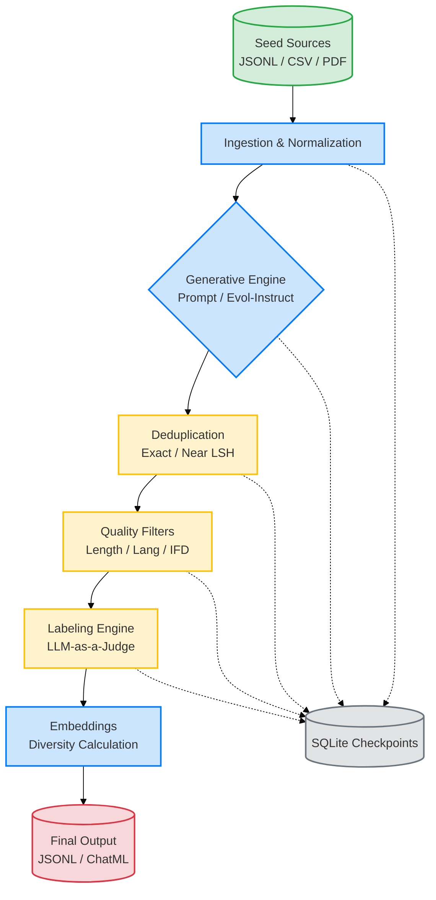

# arka (अर्क)
Config-driven synthetic data generation framework built from first principles.

## Architecture Pipeline



## Quick Start

The fastest way to get started and see Arka in action is via the terminal using our example configs. We use `uv` for fast dependency management.

```bash
# 1. Install dependencies via justfile
just setup

# 2. Export your chosen LLM provider API key
export OPENROUTER_API_KEY="sk-or-v1-..."

# 3. Run a minimal example (Seed -> Normalize -> Generate -> Output)
uv run arka --config examples/01-minimal.yaml --run-id quickstart

# 4. View artifacts
ls -la runs/quickstart/
```
All pipeline artifacts land in `runs/<run_id>/` and the final output dataset is placed according to the configured YAML path.

## Common Commands
- `just test` — run tests
- `just matrix` — run the supported config/runtime validation matrix
- `just check` — lint, format-check, test
- `just run` — run `arka` with default `config.yaml`
- `uv run arka --config examples/01-minimal.yaml --run-id quickstart` — run minimal example

## Current Implemented Path
- seed source (JSONL/CSV) → normalize → prompt-based generate → exact dedup → near dedup
- cheap filters: length, language
- single-judge labeling quality filter
- resumable runner with SQLite checkpoints
- artifacts: `data.parquet`, `dropped.parquet`, `clusters.parquet`, `stats.json`, `manifest.json`, `run_report.json`, `samples.jsonl`, `canaries.json`
- diversity embeddings: local HuggingFace-style model by default (`all-MiniLM-L6-v2` via FastEmbed), configurable to provider/OpenAI-compatible APIs
- OpenAI-compatible client with structured-output strategy chain

## Example Configs
- `examples/README.md` — example catalog
- `examples/01-minimal.yaml` — smallest runnable path
- `examples/02-openrouter-quickstart.yaml` — OpenRouter quickstart
- `examples/03-csv-seeds.yaml` — CSV seed ingestion
- `examples/04-evol-instruct.yaml` — multi-round Evol-Instruct example
- `examples/05-pdf-grounded.yaml` — PDF chunk to grounded generation example
- `examples/06-dedup-quality-filter.yaml` — dedup + quality filter example
- `examples/07-resume-debug.yaml` — resume/debug example
- `docs/validation-matrix.md` — supported options, quality bar, and release checks

OpenAI-compatible routing, including OpenRouter-backed paths, is supported in practice.
