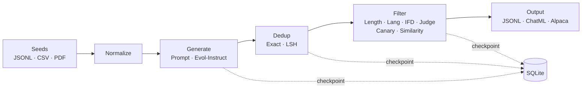

# arka (अर्क)

Config-driven synthetic data generation for supervised fine-tuning.

   

## Why arka

Building SFT datasets usually means writing one-off scripts that are hard to reproduce, debug, or iterate on. Arka replaces that with a single YAML config that declaratively defines the entire pipeline — from seed ingestion through generation, deduplication, quality filtering, and output — with full checkpointing so runs are resumable and every stage produces inspectable artifacts.

## Quick Start

```bash
just setup                        # install deps via uv
export OPENROUTER_API_KEY=sk-...  # or any OpenAI-compatible key
uv run arka --config examples/01-minimal.yaml --run-id quickstart
```

Artifacts land in `runs/quickstart/` and the final dataset at the configured output path. Use `--dry-run` to preview stages without running.

## How It Works



- **Multi-source ingestion** — JSONL, CSV, or chunked PDF with configurable overlap
- **Two generation strategies** — prompt-based or multi-round Evol-Instruct with operator selection
- **O(n) near-dedup** — MinHash + LSH band bucketing, not brute-force
- **Privacy guardrails** — canary phrase detection and semantic similarity filtering
- **Resumable runs** — SQLite checkpoints; every stage writes `data.parquet`, `dropped.parquet`, and `stats.json`

## Example Config

```yaml
version: "1"
llm:
  provider: openai
  model: google/gemini-3.1-flash-lite-preview
  api_key: ${OPENROUTER_API_KEY}
  base_url: https://openrouter.ai/api/v1
data_source:
  type: seeds
  path: ./seeds.jsonl
generator:
  type: prompt_based
  target_count: 100
  generation_multiplier: 2
dedup:
  - type: near
    lsh_bands: 16
filters:
  target_count: 100
  stages:
    - type: canary
      phrases: ["SECRET_TOKEN"]
output:
  format: chatml
  path: ./output/dataset.jsonl
```

## Documentation

- **[Features & Architecture](docs/features.md)** — pipeline stages, dedup strategies, filter stack
- **[Configuration Reference](docs/configuration.md)** — every YAML key explained
- **[Example Configs](examples/README.md)** — 8 runnable examples from minimal to privacy guardrails

## Development

```bash
just check   # ruff lint + format check + pytest (238 tests, 90% coverage)
just test    # pytest only
```

## License

MIT
