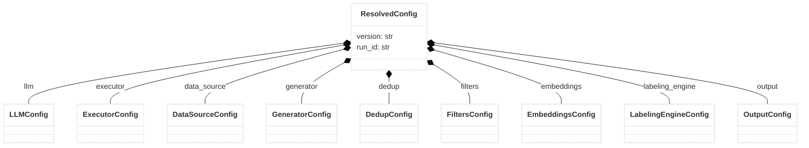

# Configuration Reference

Arka is completely configuration-driven. The entirety of a generation run—from LLM credentials to strict filtering rules—is defined in a single YAML file. This document details the schema of the Arka configuration, corresponding to the `ResolvedConfig` Pydantic model.

---

## High-Level Anatomy

A complete configuration file is composed of several logical blocks mapping to pipeline dependencies.



Here is an outline of the top-level keys in YAML:

```yaml
version: "1"
run_id: "optional-explicit-id"
llm: {...}
executor: {...}
data_source: {...}
generator: {...}
dedup: {...}
filters: {...}
embeddings: {...}
labeling_engine: {...}
output: {...}
```

---

## 1. Top-Level Metadata

| Key | Type | Default | Description |
| :--- | :--- | :--- | :--- |
| `version` | `str` | **Required** | The version of the configuration schema. Currently must be `"1"`. |
| `run_id` | `str` | `None` | A unique string identifying the run. Used for checkpointing, resuming, and artifact folder naming. If omitted, the CLI `--run-id` flag is used, or one is auto-generated. |

---

## 2. LLM (`llm`)

Defines the connection to the Language Model used for generation (and optionally, evaluation). Arka expects an OpenAI-compatible API endpoint.

```yaml
llm:
  provider: openai
  model: gpt-4o-mini
  api_key: ${OPENAI_API_KEY}
  base_url: https://api.openai.com/v1
  timeout_seconds: 60.0
  max_retries: 5
```

| Key | Type | Default | Description |
| :--- | :--- | :--- | :--- |
| `provider` | `Literal["openai"]` | **Required** | The provider protocol. Currently only `"openai"` is supported (works for OpenAI, OpenRouter, vLLM, etc.). |
| `model` | `str` | **Required** | The exact model ID expected by the provider. |
| `api_key` | `str` | **Required** | The authentication token. **Best Practice:** Use environment variable substitution (e.g. `${MY_KEY}`). |
| `base_url` | `HttpUrl` | **Required** | The base URL for the API endpoints. |
| `timeout_seconds` | `float` | `30.0` | Connection timeout in seconds. |
| `max_retries` | `int` | `3` | Number of times to retry on transient errors (e.g., rate limits, 502s). |
| `supports_json_schema`| `bool` | `None` | Override auto-detection for whether the provider natively supports JSON Schema structured outputs. |
| `openai_compatible` | `Object` | `None` | Advanced settings for third-party endpoints. |

### `openai_compatible` Object
Used to send specific headers required by aggregators like OpenRouter.
* `referer` (`HttpUrl`): Identifies your application URL.
* `title` (`str`): Identifies your application name.

---

## 3. Executor (`executor`)

Controls concurrency and throughput.

```yaml
executor:
  mode: threadpool
  max_workers: 10
```

| Key | Type | Default | Description |
| :--- | :--- | :--- | :--- |
| `mode` | `Literal["threadpool", ...]` | `"threadpool"`| The execution strategy. |
| `max_workers` | `int` | `4` | Maximum number of concurrent tasks (API requests) to run in parallel. Increase this based on your API rate limits. |

---

## 4. Data Source (`data_source`)

Defines where to load the initial seed data.

```yaml
data_source:
  type: pdf
  path: ./documents/manual.pdf
  chunk_strategy: fixed
  chunk_size_chars: 2000
  chunk_overlap_chars: 200
```

| Key | Type | Default | Description |
| :--- | :--- | :--- | :--- |
| `type` | `str` | **Required** | The source format: `"seeds"` (JSONL), `"csv"`, or `"pdf"`. |
| `path` | `str` | `None` | File system path to the source data. |
| `chunk_strategy` | `str` | `"fixed"` | Used only for `type: "pdf"`. Strategy for breaking down large text. |
| `chunk_size_chars` | `int` | `3000` | Used for `pdf`. Number of characters per chunk. |
| `chunk_overlap_chars`| `int` | `300` | Used for `pdf`. Number of overlapping characters between chunks to preserve context. |

---

## 5. Generator (`generator`)

The core of the synthetic data generation logic.

### Standard Prompt-Based Example

```yaml
generator:
  type: prompt_based
  target_count: 1000
  generation_multiplier: 2
  prompt_template: >
    Generate a new instruction-response pair similar to the following seed.
    Seed: {seed_instruction}
    Response: {seed_response}
  temperature: 0.8
```

### Evol-Instruct Example

```yaml
generator:
  type: evol_instruct
  target_count: 500
  generation_multiplier: 3
  rounds: 2
  branching_factor: 2
  operators: ["add_constraints", "deepen"]
```

| Key | Type | Default | Description |
| :--- | :--- | :--- | :--- |
| `type` | `str` | **Required** | Strategy: `"prompt_based"` or `"evol_instruct"`. |
| `target_count` | `int` | **Required** | The desired number of items to generate. |
| `generation_multiplier`| `int` | **Required** | Oversampling factor. If set to `3` with a target of 100, Arka generates 300 items, anticipating that deduplication and filters will drop many. |
| `prompt_template` | `str` | *(Default template)*| Jinja-style template. Supports `{seed_instruction}` and `{seed_response}`. |
| `temperature` | `float` | `0.7` | LLM sampling temperature. |
| `max_tokens` | `int` | `512` | Maximum length of the generated response. |
| `rounds` | `int` | `None` | (Evol-Instruct only) Number of evolution rounds to perform. |
| `branching_factor` | `int` | `None` | (Evol-Instruct only) Number of variations to create per seed, per round. |
| `operators` | `list[str]` | `[]` | (Evol-Instruct only) Allowed mutation operators. |
| `filter` | `Object` | *See below* | (Evol-Instruct only) Specific rules for dropping bad evolutions. |

#### Evol Filter (`filter`)
* `min_edit_distance_chars` (`int`, default: `20`): Discard if the evolved instruction is too similar to the parent.
* `min_instruction_chars` (`int`, default: `20`): Discard if the evolved instruction is too short.
* `refusal_keywords` (`list[str]`): Discard if the output contains phrases like `"I cannot"`, `"As an AI"`.

---

## 6. Deduplication (`dedup`)

Settings for removing near-identical generations.

```yaml
dedup:
  exact:
    enabled: true
  near:
    enabled: true
    shingle_size: 5
    lsh_bands: 16
    jaccard_threshold: 0.85
```

| Key | Description |
| :--- | :--- |
| **`exact.enabled`** | (`bool`, default: `False`) Enables fast byte-for-byte exact match filtering. |
| **`near.enabled`** | (`bool`, default: `False`) Enables MinHash/LSH fuzzy deduplication. |
| `near.shingle_size` | (`int`, default: `5`) Size of character/word n-grams for hashing. |
| `near.num_hashes` | (`int`, default: `128`) Resolution of the MinHash signature. |
| `near.lsh_bands` | (`int`, default: `16`) Number of LSH bands for bucketing. Records are only compared within matching bands, reducing dedup from O(n²) to O(n). |
| `near.jaccard_threshold`| (`float`, default: `0.7`) Similarity threshold (0.0 to 1.0). Higher means stricter matching (only very similar items are dropped). |

---

## 7. Filters (`filters`)

Defines the quality gates that generations must pass to make it to the final dataset.

```yaml
filters:
  target_count: 500
  length:
    enabled: true
    min_response_chars: 50
  language:
    enabled: true
    allowed: ["en", "es"]
```

| Block | Key | Type | Default | Description |
| :--- | :--- | :--- | :--- | :--- |
| **Base** | `target_count` | `int` | **Required** | The final target number of valid items you want in your dataset after all filtering. |
| **Length** | `enabled` | `bool` | `False` | Enable length restrictions. |
| | `min_instruction_chars` | `int` | `10` | Minimum length for instructions. |
| | `max_instruction_chars` | `int` | `4096` | Maximum length for instructions. |
| | `min_response_chars` | `int` | `10` | Minimum length for responses. |
| | `max_response_chars` | `int` | `16384`| Maximum length for responses. |
| **Language**| `enabled` | `bool` | `False` | Enable automatic language detection filtering. |
| | `allowed` | `list[str]`| `["en"]`| List of allowed ISO language codes. |
| **IFD** | `enabled` | `bool` | `False` | Enable Instruction Following Difficulty scoring. |
| | `min_score` | `float` | `0.2` | Minimum IFD score required to pass. |
| **Labeling**| `enabled` | `bool` | `False` | Enable LLM-as-a-judge rubric grading. |
| | `rubric_path` | `str` | `None` | Path to the YAML rubric definition file. |
| | `min_overall_score`| `float` | `None` | Threshold score to pass the judge's evaluation. |

---

## 8. Embeddings (`embeddings`)

Configures how diversity embeddings are calculated for the dataset.

```yaml
embeddings:
  provider: huggingface
  model: all-MiniLM-L6-v2
```

| Key | Type | Default | Description |
| :--- | :--- | :--- | :--- |
| `provider` | `str` | `"huggingface"`| Provider to use. Either `"huggingface"` (local via FastEmbed) or `"openai"`. |
| `model` | `str` | `"all-MiniLM-L6-v2"`| The embedding model identifier. |
| `api_key` | `str` | `None` | Only required if using the `"openai"` provider. |
| `base_url` | `HttpUrl` | `None` | Only required if using a custom endpoint for the `"openai"` provider. |

---

## 9. Labeling Engine (`labeling_engine`)

Settings governing the LLM-as-a-judge system if the labeling filter is enabled.

```yaml
labeling_engine:
  rubric_path: ./rubrics/helpfulness.yaml
  mode: single
```

| Key | Type | Default | Description |
| :--- | :--- | :--- | :--- |
| `rubric_path` | `str` | `None` | Path to the rubric definition. |
| `mode` | `str` | `"single"` | Labeling mode. `"single"` for a single judge evaluation, `"multi"` for multi-judge consensus. |

---

## 10. Output (`output`)

Defines how and where the final fine-tuning dataset is written.

```yaml
output:
  format: chatml
  path: ./output/dataset.jsonl
```

| Key | Type | Default | Description |
| :--- | :--- | :--- | :--- |
| `format` | `str` | **Required** | The target schema format. Supports `"jsonl"` (raw instruction/response pairs), `"chatml"`, or `"alpaca"`. |
| `path` | `str` | **Required** | Path where the final file will be saved. |
