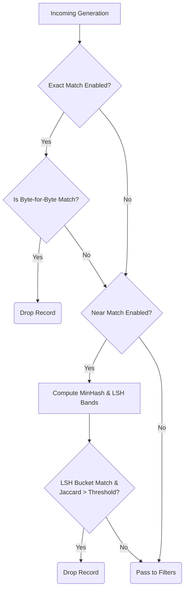

# Arka Features & Architecture

Arka (अर्क) is a configuration-driven framework designed from first principles to generate high-quality synthetic data for supervised fine-tuning (SFT). Instead of writing imperative, one-off scripts for every new synthetic dataset, Arka allows you to declaratively define the entire generation pipeline—from raw seed ingestion to final deduplicated, filtered outputs.

This document dives deep into the core capabilities and the architectural stages that data passes through during a run.

```mermaid
%%{init: {'theme': 'base', 'themeVariables': { 'primaryColor': '#ffffff', 'edgeLabelBackground':'#ffffff', 'tertiaryColor': '#f4f4f4'}}}%%
flowchart LR
    subgraph Input Phase
        A1(JSONL)
        A2(CSV)
        A3(PDF)
    end

    subgraph Transformation Pipeline
        B[Normalization]
        C[LLM Generator]
        D[Deduplication]
        E[Quality Filters]
        F[LLM Judge]
    end

    subgraph Output Phase
        G[Embeddings]
        H(SFT Dataset)
        I(Rich Artifacts)
    end

    A1 --> B
    A2 --> B
    A3 --> B
    B --> C
    C --> D
    D --> E
    E --> F
    F --> G
    G --> H
    G --> I

    classDef phase fill:#fcfcfc,stroke:#ccc,stroke-width:1px,stroke-dasharray: 5 5;
    class Input Phase phase;
    class Transformation Pipeline phase;
    class Output Phase phase;
```

---

## 1. Data Source & Ingestion

The first step in any synthetic generation pipeline is acquiring high-quality seed examples. Arka supports multiple ingestion mechanisms designed to normalize inputs into a standard internal record format.

* **JSONL Seeds**: Ingest pre-formatted pairs (e.g., instructions and responses) directly from `.jsonl` files. This is the fastest way to bootstrap generation if you already have curated seeds.
* **CSV Seeds**: Support for tabular data where columns represent the required instruction and response fields.
* **PDF Document Parsing**: For grounded generation tasks, Arka can parse raw PDF files. It automatically extracts text and applies a configurable chunking strategy (e.g., fixed-size chunks with overlapping windows) to create seed examples representing document context.

## 2. Generative Engines

Once seeds are normalized, they pass into the generation stage. Arka delegates the actual synthesis to Large Language Models (LLMs) configured via the `llm` block.

* **Prompt-Based Generation**: The most flexible approach. Arka takes a user-defined prompt template (which can inject the seed instruction and response) and uses it to instruct the LLM to generate a *new*, distinct example.
* **Evol-Instruct Pipeline**: An advanced, multi-round generative strategy. Based on the Evol-Instruct methodology, this engine takes a base instruction and iteratively applies "mutations" (operators) to increase its complexity, depth, or specificity over several rounds. You can configure branching factors (how many variations to create per seed) and specific operators to use.
* **LLM & Structured Output**: Arka natively integrates with OpenAI-compatible APIs (including OpenRouter). It strictly enforces JSON schema adherence on the provider side, guaranteeing that the generated artifacts are always parseable and immediately usable.

## 3. Deduplication Strategies

LLMs are prone to mode collapse—generating very similar responses for slightly different prompts. To maintain diversity, Arka implements robust deduplication.



* **Exact Deduplication**: A fast, hash-based check to instantly drop any generated instruction or response that is a byte-for-byte exact match of an existing record in the dataset.
* **Near Deduplication (Fuzzy Matching)**: Employs MinHash signatures with Locality Sensitive Hashing (LSH) band bucketing for O(n) average-case performance. Records are hashed into LSH bands and only compared against candidates in matching buckets, then verified via Jaccard similarity. This catches generations that are structurally identical or only differ by a few words, ensuring high dataset variance without the O(n²) cost of exhaustive comparison.

## 4. Multi-Stage Quality Filtering

Quantity does not equal quality in SFT. Arka passes generated candidates through a gauntlet of configurable filters.

* **Heuristic Filters**:
    * **Length Limits**: Enforce strict minimum and maximum character counts for both instructions and responses to prevent abnormally short or truncated outputs.
    * **Language Enforcement**: Uses fast, local models to identify the language of the output and strictly discard anything outside the configured target (e.g., ensuring 100% English outputs).
* **Advanced Metrics**:
    * **IFD (Instruction Following Difficulty)**: Arka can calculate an IFD score to estimate how difficult an instruction is for a model to follow, filtering out trivial or overwhelmingly complex examples based on a threshold.
* **LLM-as-a-Judge (Labeling Engine)**: The ultimate quality gate. Arka can send the generated pairs to an evaluator LLM alongside a strict YAML rubric. The judge scores the example across various dimensions (e.g., clarity, helpfulness, safety), and Arka drops any record falling below the `min_overall_score`. Supports both single-judge and multi-judge consensus modes.
* **Evol-Specific Filters**: When using Evol-Instruct, Arka enforces minimum edit distances between the original and evolved instruction, and scans for "refusal keywords" (e.g., "As an AI, I cannot...") to automatically drop alignment-refusal responses.

## 5. Diversity Embeddings

To provide deeper insight into the semantic coverage of your dataset, Arka can compute dense vector embeddings for all surviving records.

* Integrates with FastEmbed for fast, local HuggingFace models (like `all-MiniLM-L6-v2`), avoiding expensive API calls.
* Alternatively, supports remote embedding models via OpenAI-compatible endpoints.
* Embeddings are exported as artifacts, allowing researchers to plot, cluster, and visualize the dataset's topical distribution.

## 6. Resilient Execution & Checkpointing

Synthetic generation runs can take hours and cost money. Arka is built to be resilient.

* **Checkpoints**: At every stage of the pipeline, Arka commits state to a local SQLite database. If a run crashes, is interrupted, or hits an API rate limit, it can be resumed exactly where it left off using the `--run-id`.
* **Concurrency**: Optimized thread-pool execution ensures high throughput when making API calls, controlled via `max_workers`.
* **Rich Artifacts**: Arka writes outputs using Polars into structured Parquet files (`data.parquet`, `dropped.parquet`, `clusters.parquet`). It also produces a detailed `run_report.json` detailing exactly how many items were dropped at each specific filter stage.

## 7. Export Formatting

Finally, Arka converts the surviving, high-quality records into formats ready for immediate fine-tuning frameworks (like Axolotl or LLaMA-Factory).

* Supported native exports: `jsonl`, `chatml`, and `alpaca`.
