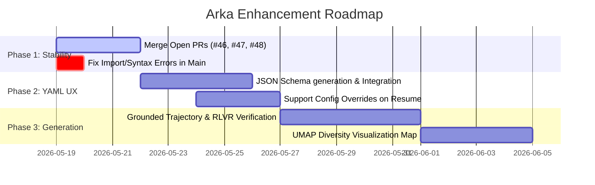

# Arka Roadmap & Optimization Plan (May 19, 2026)

This document outlines the current scope of Arka (अर्क), details of the active/open PRs, and a concrete plan to elevate this framework to a world-class config-driven synthetic data generation tool.

---

## 1. Project Scope & Architecture

Arka is a config-driven synthetic data generation framework built from first principles. Its main focus is to replace brittle, one-off scripts with a declarative pipeline defined via YAML, backed by robust validation, checkpointing, and evaluation.

### Core Architecture
- **Ingestion**: Sourcing seed data from `JSONL`, `CSV`, or chunked `PDF` contexts.
- **Generation**: Prompt-based or `Evol-Instruct` strategies that synthesize raw instruction-response records.
- **Deduplication**: Exact hash deduplication and O(n) Near-deduplication (MinHash + LSH band bucketing).
- **Filtering**: Multi-stage filters (length, language, IFD, canary, reward model, semantic similarity, and LLM-as-a-judge).
- **Embeddings**: Local (FastEmbed) or remote (OpenAI) embedding extraction for semantic visualization.
- **Resilience**: SQLite-backed stage-level checkpointing for resuming interrupted runs.

### Excluded from Scope
- General pre-training/crawl curation.
- Multimodal data (images/audio).
- High-level Web UIs or heavy cloud orchestration (distilabel, curator, or LangChain wrapper layers).

---

## 2. Active & Open Pull Requests

Currently, there are **three open PRs** representing active work streams:

1. **PR #46 (`Bolt: CheckpointManager uses single thread-safe WAL connection`)**
   - **Goal**: Addresses SQLite connection bottlenecks.
   - **Details**: Switches SQLite database connection to WAL mode and `synchronous=NORMAL` using a single thread-safe connection.
   - **Impact**: Reduces checkpoint latency by 20-40% under concurrent threadpool execution.

2. **PR #47 (`Palette: [DX improvement] Improve ConfigValidationError messages`)**
   - **Goal**: Enhances developer feedback when loading configurations.
   - **Details**: Standardizes and beautifies Pydantic validation errors (e.g., mapping raw dict/missing field schema errors to clean, human-readable CLI outputs).
   - **Impact**: Removes developer friction by explicitly identifying missing, misspelled, or extra forbidden keys in YAML.

3. **PR #48 (`Palette: Add execution duration tracking to pipeline run summary`)**
   - **Goal**: Adds duration metadata to the run manifest.
   - **Details**: Adds run duration calculation to the CLI outputs and report manifest.
   - **Bug Fix**: Fixes a broken import (`_drop_record`) and parameter passing error inside `double_critic_stage.py` that is currently causing pipeline validation tests to fail on the main branch.

---

## 3. How to Make Arka World-Class

To elevate Arka into a best-in-class tool for researchers and engineers training SFT and RL models, we propose improvements across four main dimensions:

### A. Advanced Synthetic Data Pipelines (Simula + RL Alignment)
1. **Dynamic Taxonomy Generation**: Instead of static seed pools, use LLMs to seed a diverse hierarchical taxonomy (Simula style) of topics, domains, and tasks, then sample nodes from the taxonomy to generate seedless instructions.
2. **Double-Critic & Anti-Sycophancy Loop**: Fully enforce the double-critic pipeline (asking the LLM both "Is this correct?" and "Is this incorrect?") to filter out sycophantic or low-accuracy generations.
3. **GRPO / RLVR Data Generation**: Support generating multiple candidate responses per prompt, calculating rule-based verifications (e.g. format checks, unit tests, or math verifiers), and exporting them as structured preference lists.

### B. Declarative YAML UX & Polymorphic Configuration
1. **Pipeline Schema Autocomplete**: Provide a JSON Schema file (`schema.json`) so IDEs (VS Code, Cursor) automatically provide auto-complete, validation, and docstring tooltips for Arka configurations.
2. **Interactive Scaffold Generator**: Add a CLI command (e.g., `arka init`) that interactively generates custom YAML configs based on user preferences.
3. **Flexible Resume Mode**: Support resuming runs with minor parameter overrides (e.g., changing the judge's score threshold `min_overall_score` without having to regenerate all base LLM prompts).

### C. First-Class Synthetic Data Evaluation (UMAP & Contamination)
1. **Local Semantic Visualization**: Automatically run UMAP/t-SNE clustering on the generated FastEmbed embeddings to write a `runs/<run_id>/diversity_map.html` visualization showing semantic clusters and topic density.
2. **Automated Contamination Auditing**: Scan generated instructions for n-gram overlap against common open evaluations (MMLU, GSM8K, HumanEval) to prevent downstream metric contamination.
3. **Elo-Rating complexity evaluation**: Fully implement the batch-Elo tournament stage, where records compete against each other via LLM-pairwise comparison to discover the highest quality instructions.

---

## 4. Concrete Execution Plan

Here is a step-by-step roadmap to stabilize the codebase and achieve this world-class vision:

### Action Items:
- [ ] **Step 1**: Sync the current branch with the fixes from PR #48 to fix the import error (`_drop_record`) in `src/arka/pipeline/double_critic_stage.py`.
- [ ] **Step 2**: Generate and hook up a `schema.json` configuration file for VS Code integration.
- [ ] **Step 3**: Design the UMAP HTML visualization generator stage.
- [ ] **Step 4**: Introduce math/code verifier filters to support GRPO dataset creation.
